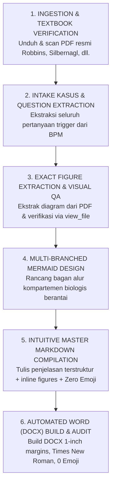

# Logbook 3.1 Medical Expert System & Strict Quality Guardrails

## 1. Overview & Purpose
Skill ini membekali agen AI dengan protokol terstruktur, standar akademik kedokteran tingkat lanjut, dan **sistem guardrail ketat (*unbreakable guardrails*)** untuk menyusun **Buku Logbook Mahasiswa PBL** berstandar keunggulan klinis untuk **Blok 3.1: Balance & Pathology (Fakultas Kedokteran Universitas Jenderal Soedirman)**.

Skill ini memastikan mahasiswa menguasai konsep-konsep patologi dasar, imunologi, mikrobiologi/parasitologi, toksikologi lingkungan, dan farmakologi secara deduktif-induktif, memenuhi capaian pembelajaran **CPL 1, CPL 2, CPL 4, dan CPL 5** tanpa adanya kesalahan sitasi, kesalahan gambar, maupun asumsi tidak berdasar.

---

## 2. Mandatory Quality Guardrails (Sistem Pertahanan Kualitas Mutlak)

Setiap agen AI yang menyusun atau merevisi logbook Blok 3.1 **DIWAJIBKAN MEMATUHI 6 GUARDRAIL MUTLAK BERIKUT**:

```
+---------------------------------------------------------------------------------------------+
|                                6 UNBREAKABLE QUALITY GUARDRAILS                              |
+---------------------------------------------------------------------------------------------+
| 1. MANDATORY TEXTBOOK INGESTION FIRST  -> Wajib unduh & baca PDF buku ajar resmi BPM dulu   |
| 2. AUTHENTIC TEXTBOOK FIGURE EXTRACTION -> Ekstrak gambar langsung dari PDF (No Web/No AI)  |
| 3. ZERO HALLUCINATION & ZERO FAKE REFS -> Sitasi 1-to-1 sesuai literatur resmi BPM/PubMed   |
| 4. INLINE CONTEXTUAL PRESENTATION      -> Gambar disematkan langsung di bawah soal (No Dump)|
| 5. ZERO EMOJI FORMALITY                -> Bersih 100% dari emoji di DOCX dan Markdown       |
| 6. INTUITIVE PEDAGOGICAL CLARITY       -> Analogi jelas & logika bernomor (1 -> 2 -> 3)     |
+---------------------------------------------------------------------------------------------+
```

### 🛡️ Guardrail 1: Mandatory Official Textbook Ingestion First
* **Aturan Absolut**: Dilarang keras mulai menulis jawaban atau merancang diagram sebelum mengunduh dan memeriksa berkas PDF buku ajar rujukan resmi yang tertera di Buku Panduan Mahasiswa (BPM) Blok 3.1:
  1. *Robbins & Cotran Pathologic Basis of Disease* (Kumar, Abbas, & Aster).
  2. *Color Atlas of Pathophysiology* (Silbernagl & Lang).
  3. *Cellular and Molecular Immunology* (Abbas, Lichtman, & Pillai).
  4. *Casarett & Doull's Toxicology* (Klaassen).
* **Prosedur**: Seluruh berkas PDF wajib tersimpan di direktori `textbooks/` dan agen wajib membaca bab/halaman terkait menggunakan script ekstraksi sebelum menyusun narasi.

### 🛡️ Guardrail 2: Authentic Textbook Figure Extraction (Zero AI / Zero Unverified Web Images)
* **Aturan Absolut**: Dilarang keras mengambil gambar acak dari Google Images, Pinterest, atau menggunakan AI image generator untuk ilustrasi patologi medis.
* **Prosedur Ekstraksi**:
  1. Ekstrak gambar langsung dari pelat warna atau diagram vektor PDF buku ajar resmi menggunakan `PyMuPDF` (`fitz`) dengan resolusi tinggi (skala matrix $\ge 2.5$ atau 216 DPI).
  2. Lakukan *cropping* presisi pada kotak diagram agar tidak menyertakan kolom teks bacaan yang tidak relevan.
  3. **Wajib Inspeksi Visual**: Agen wajib menjalankan `view_file` pada gambar hasil ekstraksi untuk memeriksa dengan "mata sendiri" bahwa gambar tersebut benar-benar memuat diagram mekanisme, kurva enzim, atau tabel patofisiologi yang tepat.

### 🛡️ Guardrail 3: Zero Hallucination & Zero Fake Citations
* **Aturan Absolut**: Dilarang keras merekayasa atau memalsukan nama penulis, tahun, edisi buku, nomor halaman, ataupun jurnal pendukung.
* **Prosedur**:
  1. Semua sitasi dalam teks (*in-text citations*) dan entri Daftar Pustaka wajib terpetakan 1-to-1 pada buku ajar resmi BPM atau jurnal ilmiah terindeks PubMed/StatPearls dengan DOI/PMID yang valid.
  2. Gunakan gaya pengutipan **Harvard Referencing Style** standar FK UNSOED secara konsisten.

### 🛡️ Guardrail 4: Inline Contextual Presentation (No Separate Figure Dumps)
* **Aturan Absolut**: Dilarang menyajikan gambar-gambar pada bagian terpisah (*isolated figure gallery/dump section*).
* **Prosedur**: Setiap gambar wajib disematkan langsung secara menyatu (*inline*) di bawah pertanyaan/sub-pokok bahasan yang dijelaskannya, lengkap dengan *caption* berbahasa Indonesia yang menguraikan makna diagram tersebut secara gamblang.

### 🛡️ Guardrail 5: Strict Zero-Emoji Formality
* **Aturan Absolut**: Dokumen logbook adalah naskah akademik kedokteran formal. **Total emoji di DOCX dan Markdown harus 0 (NOL)**.
* **Larangan**: Dilarang menggunakan simbol dekoratif atau emotikon informal (seperti 🫀, 🎨, 💡, ❓, 📄, 📚, 🏆). Gunakan tipografi standar *Times New Roman*, teks tebal (*bold*), dan tabel formal bergaris abu-abu.

### 🛡️ Guardrail 6: Intuitive Pedagogical Clarity & Step-by-Step Logic
* **Aturan Absolut**: Hindari tumpukan kalimat majemuk yang berbelit-belit (*wall of text*).
* **Struktur Penjelasan**:
  1. **Intisari Intuitif**: Buka jawaban dengan 1–2 kalimat sederhana atau analogi klinis konkret yang mudah dipahami.
  2. **Logika Bernomor**: Uraikan tahapan mekanisme biologis secara sekuensial (1 $\to$ 2 $\to$ 3).
  3. **Tabel Komparasi Kontras**: Sajikan tabel pembanding tegas untuk konsep-konsep komparatif (Iskemia vs Hipoksia, 4 Adaptasi Seluler, Nekrosis vs Apoptosis).

---

## 3. Workflow Prosedural Terstandarisasi (6-Fase OMNIFLUX)



---

## 4. Referensi Pustaka Standar Wajib (Sesuai BPM Blok 3.1)

1. **Kumar, V., Abbas, A. K. and Aster, J. C.** (2021) *Robbins & Cotran Pathologic Basis of Disease*. 10th edn. Philadelphia: Elsevier.
2. **Silbernagl, S. and Lang, F.** (2009/2016) *Color Atlas of Pathophysiology*. 2nd/3rd edn. Stuttgart: Georg Thieme Verlag.
3. **Abbas, A. K., Lichtman, A. H. and Pillai, S.** (2022) *Cellular and Molecular Immunology*. 10th edn. Philadelphia: Elsevier.
4. **Chen, J., Al-Awqati, M., Anderson, J. and Varacallo, M.** (2023) *Physiology, Pain*. StatPearls [Internet]. Treasure Island (FL): StatPearls Publishing. Available at: https://www.ncbi.nlm.nih.gov/books/NBK539745/ (PMID: 31536290).
5. **Dinakar, P. and Stillman, A. M.** (2016) 'Pathogenesis of Pain', *Seminars in Pediatric Neurology*, 23(3), pp. 201–208. doi: 10.1016/j.spen.2016.10.003.
6. **Karcz, M., Kaczor, M., Szczepanik, M., Zukowski, M. and Kotfis, K.** (2024) 'Pathophysiology of Pain and Mechanisms of Neuromodulation: A Narrative Review (A Neuron Project)', *Journal of Pain Research*, 17, pp. 3757–3790. doi: 10.2147/JPR.S481745.
7. **Liu, S. and Kelliher, L.** (2022) 'Physiology of pain—a narrative review on the pain pathway and its application in the pain management', *Digestive Medicine Research*, 5, p. 56. doi: 10.21037/dmr-22-38.
8. **Klaassen, C. D.** (2019) *Casarett & Doull's Toxicology: The Basic Science of Poisons*. 9th edn. New York: McGraw-Hill.
9. **Cowman, A. F. et al.** (2016) 'Malaria: Biology and Disease', *Cell*, 167(3), pp. 610–624.
10. **World Health Organization** (2022) *WHO Guidelines for Malaria*. Geneva: World Health Organization.
