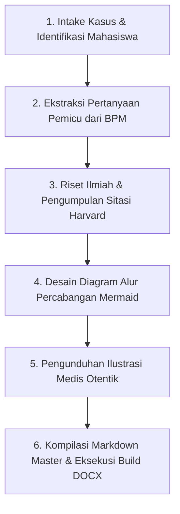

# Logbook 3.1 Medical Expert Skill

## 1. Overview & Purpose
Skill ini membekali agen AI dengan protokol terstruktur, standar akademik kedokteran, dan alat otomatisasi untuk menyusun **Buku Logbook Mahasiswa PBL** berstandar keunggulan klinis untuk **Blok 3.1: Balance & Pathology (Fakultas Kedokteran Universitas Jenderal Soedirman)**.

Skill ini dirancang untuk memastikan mahasiswa menguasai konsep-konsep patologi dasar, imunologi, mikrobiologi/parasitologi, toksikologi lingkungan, dan farmakologi secara deduktif-induktif, memenuhi capaian pembelajaran **CPL 1, CPL 2, CPL 4, dan CPL 5**.

---

## 2. Core Operational Rules (Prinsip Wajib)

Setiap penyusunan logbook HARUS mematuhi 6 aturan absolut berikut:

1. **Academic Metadata Preservation:**
   * Wajib mencantumkan identitas lengkap mahasiswa: Nama, NIM, Kelompok PBL, Dosen Tutor Pendamping, serta Alokasi Waktu Sesi Tutorial.
2. **Comprehensive Question Coverage:**
   * Seluruh pertanyaan pemicu (*trigger questions*) yang tercantum di Buku Panduan Mahasiswa (BPM) wajib dijawab tuntas 100% tanpa ada yang dilewati atau diringkas secara dangkal.
3. **Mandatory Harvard In-Text Citation:**
   * Setiap fakta medis, mekanisme patologis, jalur sinyal biokimiawi, dan data farmakologis **wajib memiliki sitasi gaya Harvard** di dalam teks (contoh: `(Kumar, Abbas and Aster, 2021; Silbernagl and Lang, 2016; Cowman et al., 2016)`).
   * Daftar Pustaka berformat Harvard terstandarisasi wajib diletakkan di akhir dokumen secara alfabetis.
4. **Deep Multi-Branched Mermaid Diagrams:**
   * Diagram alur tidak boleh berupa rantai linear sederhana.
   * Diagram alur wajib memiliki **percabangan mendalam (*multi-branching*)**, subgraf fungsional, dan mencantumkan rincian reseptor, enzim, sitokin, serta jaras saraf yang terlibat.
5. **Authentic Medical Illustrations (No AI Generation):**
   * Diagram anatomi, histopatologi, apusan darah, dan metabolisme farmakologi wajib diambil dari repositori akademik resmi (*Wikimedia Commons, OpenStax, PEIR Pathology, CDC PHIL, NIH NCI*) dengan lisensi terbuka (*CC-BY / CC-BY-SA*).
   * **Dilarang keras menggunakan AI image generator** untuk ilustrasi patologi medis.
6. **Dual Output Generation (Markdown & DOCX):**
   * Menghasilkan 1 berkas master **Markdown (`.md`)** utuh.
   * Menghasilkan 1 berkas terformat **Microsoft Word (`.docx`)** menggunakan engine `generate_docx.py` dengan tipografi Times New Roman, margin 1 inci, tabel terformat, dan gambar tersemat rapi.

---

## 3. Workflow Prosedural

Agen wajib menjalankan siklus 6-tahap berikut secara sekuensial:

### Tahap 1: Analisis Kasus & Summary Statement
* Buat ringkasan kasus klinis terstruktur (*clinical summary statement*) yang mencakup:
  * Identitas & riwayat penyakit dahulu / faktor risiko lingkungan.
  * Keluhan utama & riwayat penyakit sekarang.
  * Temuan tanda vital, pemeriksaan fisik, dan hasil penunjang/laboratorium.
  * Diagnosis kerja definitif.

### Tahap 2: Pembahasan Runtut per Pokok Bahasan
* Jawab seluruh pertanyaan pemicu secara runtut, dengan struktur:
  * Definisi operasional & konsep normal-abnormal.
  * Kaskade patofisiologis molekuler bertahap.
  * Tabel komparasi analitis untuk parameter pembeda.
  * Korelasi langsung dengan tanda/gejala klinis pada skenario pasien.

### Tahap 3: Pembuatan Diagram Alur Mermaid
* Gunakan sintaks `flowchart TD` atau `flowchart LR` dengan `subgraph` terisolasi untuk tiap kompartemen biologis.
* Render kode Mermaid ke PNG melalui script `render_mermaid.py`.

### Tahap 4: Penyusunan Dokumen DOCX Terformat
* Jalankan script `generate_docx.py` yang menerapkan:
  * Margin 1.0 inci di semua sisi.
  * Running footer: Identitas Mahasiswa & Blok.
  * Header tabel berwarna Navy Blue (`#003366`) dengan teks putih tebal.
  * Seluruh gambar dan diagram disematkan di posisi tengah (*centered*) dengan caption miring 9.5pt.

### Tahap 5: Verifikasi Terprogram (Quality Assurance)
* Jalankan `verify_logbook.py` untuk menguji kepatuhan terhadap rubrik penilaian CPL 4.

---

## 4. Referensi Pustaka Standar Wajib

1. **Kumar, V., Abbas, A. K. and Aster, J. C. (2021)** *Robbins & Cotran Pathologic Basis of Disease*. 10th edn. Philadelphia: Elsevier.
2. **Silbernagl, S. and Lang, F. (2016)** *Color Atlas of Pathophysiology*. 3rd edn. Stuttgart: Georg Thieme Verlag.
3. **Abbas, A. K., Lichtman, A. H. and Pillai, S. (2022)** *Cellular and Molecular Immunology*. 10th edn. Philadelphia: Elsevier.
4. **Cowman, A. F. et al. (2016)** 'Malaria: Biology and Disease', *Cell*, 167(3), pp. 610–624.
5. **Graham, G. G. et al. (2013)** 'The modern pharmacology of paracetamol', *Inflammopharmacology*, 21(3), pp. 201–232.
6. **Klaassen, C. D. (2019)** *Casarett & Doull's Toxicology: The Basic Science of Poisons*. 9th edn. New York: McGraw-Hill.
7. **White, N. J. et al. (2014)** 'Malaria', *The Lancet*, 383(9918), pp. 723–735.
8. **World Health Organization (2022)** *WHO Guidelines for Malaria*. Geneva: World Health Organization.
